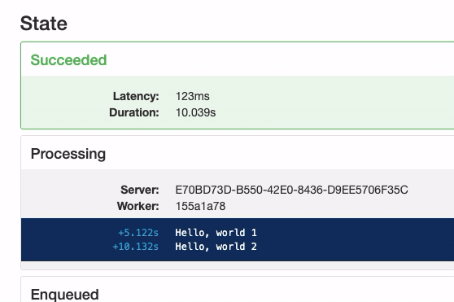

# HangfireConsoleTest

Minimal .NET Core 3 project, testing the Hangfire.Console package

## How to run

Navigate to the folder for the repo, and run `docker-compose up -d`, to start the Redis server.

Navigate to the folder `haxzorer.HangfireConsole`, and run `dotnet run`, to start the application.

## Testing the Hangfire.Console issue

In this project, there is a `TestJob` setup, that will never automatically run. 
To run it, and see the Hangfire Console endless polling issue in action, go to https://localhost:5001/hangfire/recurring and trigger it manually.
Then, find the job, either in the processing or succeeded list, and watch as the console part of the job report endlessly polls for "new" rows.

